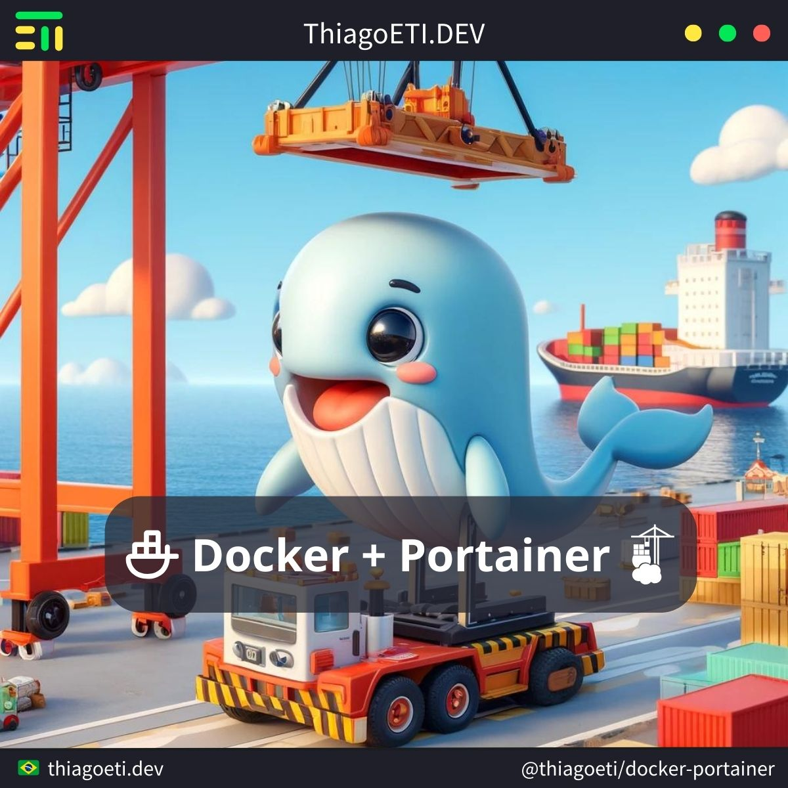

# Docker - Portainer

Tool for management of container in Docker.



#### Get container **pull**.

```console
docker pull "portainer/portainer"
```

#### Create **volume** for data.

```console
docker volume create "portainer"
ln -s "/var/lib/docker/volumes/portainer" "/data/volume/"
```

#### Create and **run** container.

```console
docker run --name "portainer" \
	-p 9000:9000 \
	-v "/var/run/docker.sock:/var/run/docker.sock" \
	-v "portainer":"/data" \
	--restart=always \
	-d "portainer/portainer"
```

#### Start container.

```console
docker start "portainer"
```

#### Insert user and password in first access.

```console
user: portainer
password: ***
```

> Important: if not first access machine in 5 minutes expire
